# Carvana Image Masking Challenge-UNet Implementation with PyTorch
<h2>Dataset and description of the problem are get from Kaggle : </h2>
https://www.kaggle.com/c/carvana-image-masking-challenge

<h2>UNet paper could be found here :</h2>
https://arxiv.org/abs/1505.04597
<h2>Run train.py for training again the model, for example:</h2>

`python train.py --img_dir="D:/datasets/carvana_image_masking_challenge/train/" --mask_dir="D:/datasets/carvana_image_masking_challenge/train_masks/" --resized_height=128 --resized_width=128 --batchsize=32 --lr=0.0001 --num_workers=4 --epochs=3`

<h2>Training and validation results: </h2>
  <ul>
    <li>num_training : 4579</li>
    <li>num_val : 509 </li>
    <li>learning rate : 1e-4</li>
    <li>resized_height,resized_width : 128</li>
    <li>batch_size: 32</li>
    <li>epochs: 3</li>
  </ul>
  
Results :

  <ul>
  <li>train loss ,val loss : 0.12</li>
  <li>train acc ,val acc : 99.24% </li>
  <li>train dice score,val dice score : 0.98 </li>
  </ul>

<h2>Testing on 10 random images from test set</h2>
<h3>Original Images</h3>

  
  
  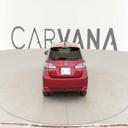
  
  
  
  
  
  
  

<h3>Masks</h3>

  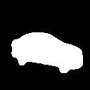
  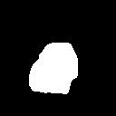
  
  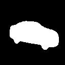
  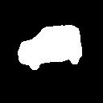
  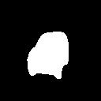
  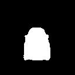
  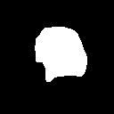
  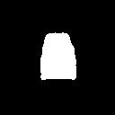
  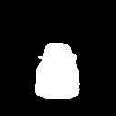

<h3>Combine masks into images</h3>

  
  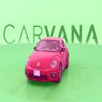
  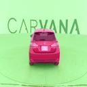
  
  
  
  
  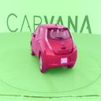
  
  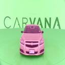

